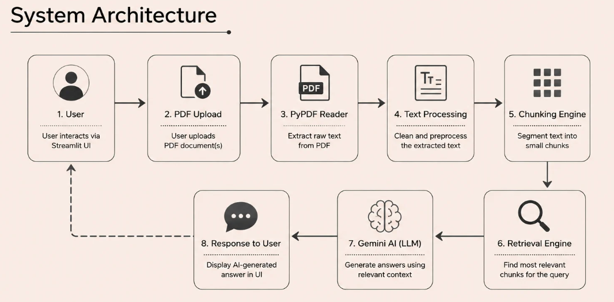

# Industrial Knowledge Brain

Industrial Knowledge Brain is an AI-powered document intelligence prototype that enables users to upload industrial PDF documents and ask questions in natural language. The system retrieves relevant information from the uploaded documents and generates answers using Google's Gemini AI.

---

## Problem Statement

Industrial organizations maintain thousands of documents such as:

- Standard Operating Procedures (SOPs)
- Equipment manuals
- Maintenance reports
- Safety guidelines
- Inspection records

Searching these documents manually is time-consuming and often leads to delayed decision-making.

---

## Our Solution

Industrial Knowledge Brain simplifies document search by allowing users to:

- Upload industrial PDF documents
- Ask questions in natural language
- Receive AI-generated answers
- View the source reference used for the answer

The application combines document processing with Google's Gemini AI to provide quick and context-aware responses.

---

## Features

-PDF Upload
-Text Extraction
-Text Cleaning
-Document Chunking
-AI-powered Question Answering
-Source Reference Display
-Streamlit Interface

---

## System Architecture



---

## Workflow

```text
          User
            │
            ▼
     Upload PDF Document
            │
            ▼
      Extract Text (PyPDF)
            │
            ▼
       Clean & Preprocess
            │
            ▼
      Split into Chunks
            │
            ▼
     Retrieve Best Chunk
            │
            ▼
      Google Gemini AI
            │
            ▼
    Generate AI Response
            │
            ▼
      Display Answer &
      Source Reference
```
---

## Technology Stack

| Technology | Purpose |
|------------|---------|
| Python | Programming Language |
| Streamlit | Web Application |
| PyPDF | PDF Text Extraction |
| Google Gemini API | AI Response Generation |
| Git | Version Control |
| GitHub | Repository Hosting |
| VS Code | Development Environment |

---

## Project Structure

```
IndustrialKnowledgeBrain/
│
├── app.py
├── README.md
├── requirements.txt
├── architecture.png
├── screenshots/
│   ├── home.png
│   ├── upload.png
│   └── answer.png
└── report.pdf
```

---

## Installation

### Clone the repository

```bash
https://github.com/sruthi-r-22/Industrial-Intelligence.git
```

### Navigate to the project

```bash
cd IndustrialKnowledgeBrain
```

### Install dependencies

```bash
pip install -r requirements.txt
```

### Run the application

```bash
streamlit run app.py
```

---

## Application Screenshots

### Home Page
Displays the main interface where users can upload industrial PDF documents and ask questions.
*(Insert screenshot)*

### Upload PDF
Users can upload one or more PDF documents for processing.
*(Insert screenshot)*

### AI Answer
The application retrieves the most relevant information from the uploaded document and generates an AI-powered 
*(Insert screenshot)*

---

## Future Scope

- Semantic Search using Vector Databases
- OCR Support for Scanned Documents
- Voice Assistant
- Multi-language Support
- Cloud Deployment
- Knowledge Graph Integration

---

## Team

- **RENTALA SRUTHI**
- **PILLARISETTY VENKATA SATVIKA**

---

## License

This project was developed as part of **ET AI HACKHATHON 2.0**.
